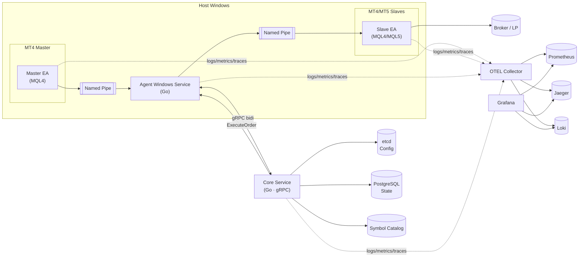
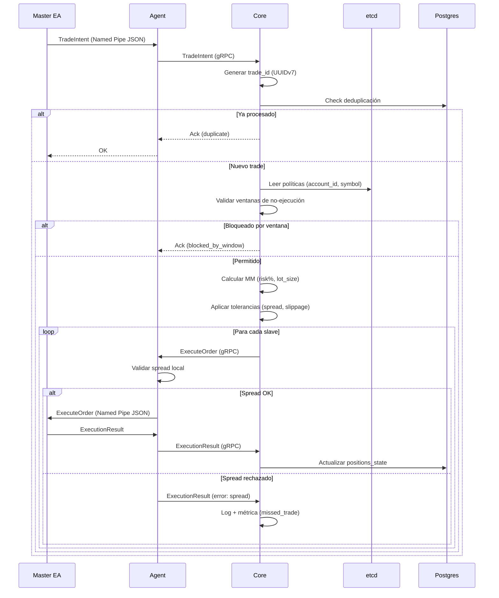
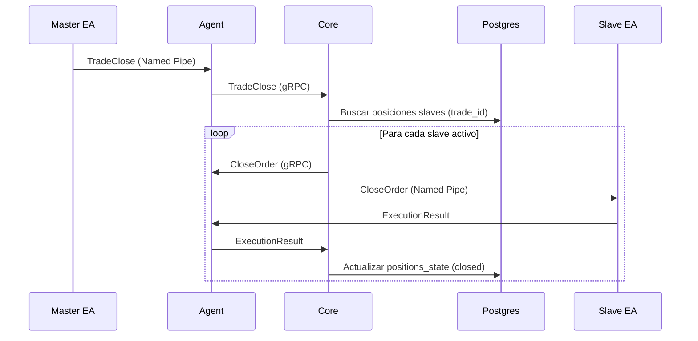

# RFC-001: Arquitectura del Sistema Echo

## 1. Resumen Ejecutivo

**Echo** es un sistema de copiado de operaciones algorítmico diseñado para replicar trades desde cuentas master (MT4/MT5) a múltiples cuentas slave con latencia <1s, tolerancias configurables y observabilidad completa.

### Alcance V1
- Solo órdenes **a mercado** (BUY/SELL, CLOSE)
- **Hedged mode** exclusivo
- **MagicNumber idéntico** para trazabilidad
- **Money Management** centralizado en core
- **Ventanas de no-ejecución** configurables
- **SL/TP opcionales** con offset y ajuste a StopLevel
- **Tolerancias** (spread, slippage, delay)
- **Observabilidad** end-to-end (logs, métricas, trazas)

### Fuera de Scope V1
- Órdenes pendientes (limit/stop)
- Reintentos inteligentes (V1 = "omit with comment")
- Event sourcing
- Seguridad avanzada (mTLS, KMS)

---

## 2. Arquitectura de Componentes

### 2.1 Diagrama General



### 2.2 Componentes Principales

| Componente | Lenguaje | Responsabilidad | Puerto |
|------------|----------|-----------------|--------|
| **Core** | Go 1.25 | Orquestación, MM, políticas, reconciliación | gRPC :50051 |
| **Agent** | Go 1.25 | Bridge gRPC ↔ IPC (Named Pipes) | IPC local |
| **Master EA** | MQL4/MQL5 | Emisión de TradeIntent al agent | - |
| **Slave EA** | MQL4/MQL5 | Ejecución de órdenes desde agent | - |
| **SDK** | Go 1.25 | Proto, telemetry, IPC helpers, domain | Librería |

---

## 3. Stack Tecnológico

### 3.1 Lenguajes y Frameworks

- **Core & Agent**: Go 1.25
- **Clientes MT4/MT5**: MQL4, MQL5
- **Contratos**: Protobuf 3 + gRPC
- **Build tool**: Buf CLI

### 3.2 Comunicación

- **Core ↔ Agent**: gRPC bidi-streaming (TLS opcional V1)
- **Agent ↔ EAs**: Named Pipes (Windows IPC) con JSON
- **Config API**: REST read-only vía grpc-gateway (futuro)

### 3.3 Persistencia

| Store | Uso | Schema |
|-------|-----|--------|
| **PostgreSQL 16** | Estado vivo, políticas, catálogos, calendario | Ver 4.3 |
| **etcd v3** | Config live con watches | Ver 4.2 |
| **MongoDB 7** | Eventos crudos (append-only, V2+) | Futuro |

### 3.4 Observabilidad

- **Logs**: `log/slog` JSON → Loki
- **Métricas**: OpenTelemetry → Prometheus
- **Trazas**: OpenTelemetry → Jaeger
- **Dashboards**: Grafana
- **Collectors**: windows_exporter, Promtail Windows, OTEL Collector

### 3.5 Identidad e Idempotencia

- **trade_id**: UUIDv7 (ordenable, único por intent)
- **Deduplicación**: Core mantiene map `trade_id → {state, attempts}`
- **Reintentos**: `attempt` field en proto

---

## 4. Contratos y Datos

### 4.1 Proto Messages (v1)

#### common.proto

```protobuf
enum OrderSide { BUY, SELL }
enum OrderType { MARKET, LIMIT, STOP, STOP_LIMIT }
enum OrderStatus { PENDING, FILLED, REJECTED, CANCELLED }
enum ErrorCode { INVALID_PRICE, INVALID_STOPS, OFF_QUOTES, ... }
```

#### trade.proto

```protobuf
message TradeIntent {
  string trade_id = 1;          // UUIDv7
  int64 timestamp_ms = 2;
  string client_id = 3;         // EA identifier
  string symbol = 4;
  OrderSide side = 5;
  double lot_size = 6;
  double price = 7;
  int64 magic_number = 8;
  int32 ticket = 9;             // MT4/MT5 ticket
  optional double stop_loss = 10;
  optional double take_profit = 11;
}

message ExecuteOrder {
  string command_id = 1;
  string trade_id = 2;
  string symbol = 4;
  OrderSide side = 5;
  double lot_size = 6;
  int64 magic_number = 7;
  optional double stop_loss = 8;
  optional double take_profit = 9;
}

message ExecutionResult {
  string command_id = 1;
  bool success = 2;
  int32 ticket = 3;
  ErrorCode error_code = 4;
  optional double executed_price = 6;
}

message CloseOrder { ... }
message ModifyOrder { ... }
message AccountInfo { ... }
message PositionInfo { ... }
message SymbolInfo { ... }
```

#### agent.proto

```protobuf
service AgentService {
  rpc StreamBidi(stream AgentMessage) returns (stream CoreMessage);
  rpc Ping(PingRequest) returns (PingResponse);
}

message AgentMessage {
  oneof payload {
    AgentHello hello;
    TradeIntent trade_intent;
    TradeClose trade_close;
    ExecutionResult execution_result;
    StateSnapshot state_snapshot;
    AgentHeartbeat heartbeat;
  }
}

message CoreMessage {
  oneof payload {
    ExecuteOrder execute_order;
    CloseOrder close_order;
    ModifyOrder modify_order;
    ConfigUpdate config_update;
    Ack ack;
  }
}
```

### 4.2 Configuración en etcd

**Estructura de claves**:

```
/echo/
  /core/
    /master_accounts       → ["MT4-001", "MT4-002"]
    /slave_accounts        → ["MT5-001", "MT5-002", ...]
  /policy/
    /{account_id}/
      /max_spread          → 5.0
      /max_slippage        → 3.0
      /max_delay_ms        → 1000
      /catastrophic_sl     → 100.0  (points)
      /copy_sl_tp          → true
      /sl_offset           → 5.0
      /tp_offset           → -5.0
      /risk_per_trade      → 2.0    (% equity)
      /max_dd_daily        → 5.0    (% equity)
  /windows/
    /{account_id}/{symbol}/
      /start_utc           → "2025-10-23T14:30:00Z"
      /end_utc             → "2025-10-23T15:00:00Z"
      /pre_buffer_sec      → 300
      /post_buffer_sec     → 300
```

**Watches**: Core escucha cambios en `/echo/policy/` y `/echo/windows/` para aplicar config en caliente.

### 4.3 Schema PostgreSQL (mínimo V1)

```sql
-- Catálogo de cuentas
CREATE TABLE accounts (
  account_id VARCHAR(50) PRIMARY KEY,
  account_type VARCHAR(10) NOT NULL, -- 'master' | 'slave'
  broker VARCHAR(50),
  is_active BOOLEAN DEFAULT true,
  created_at TIMESTAMPTZ DEFAULT NOW(),
  updated_at TIMESTAMPTZ DEFAULT NOW()
);

-- Estrategias (MagicNumber → strategy_id lógico)
CREATE TABLE strategies (
  strategy_id VARCHAR(50) PRIMARY KEY,
  magic_number BIGINT NOT NULL,
  name VARCHAR(100),
  description TEXT,
  created_at TIMESTAMPTZ DEFAULT NOW()
);

-- Mapeo de símbolos
CREATE TABLE symbols (
  canonical_symbol VARCHAR(20) PRIMARY KEY,
  description TEXT
);

CREATE TABLE broker_symbols (
  broker_symbol VARCHAR(50) PRIMARY KEY,
  canonical_symbol VARCHAR(20) REFERENCES symbols(canonical_symbol),
  broker VARCHAR(50),
  digits INT,
  point DOUBLE PRECISION,
  tick_size DOUBLE PRECISION,
  tick_value DOUBLE PRECISION,
  min_lot DOUBLE PRECISION,
  max_lot DOUBLE PRECISION,
  lot_step DOUBLE PRECISION,
  stop_level INT,
  contract_size DOUBLE PRECISION,
  updated_at TIMESTAMPTZ DEFAULT NOW()
);

-- Estado de posiciones (reconciliación)
CREATE TABLE positions_state (
  account_id VARCHAR(50) REFERENCES accounts(account_id),
  ticket INT NOT NULL,
  trade_id VARCHAR(50),
  symbol VARCHAR(50),
  side VARCHAR(10),
  volume DOUBLE PRECISION,
  open_price DOUBLE PRECISION,
  stop_loss DOUBLE PRECISION,
  take_profit DOUBLE PRECISION,
  profit DOUBLE PRECISION,
  magic_number BIGINT,
  open_time TIMESTAMPTZ,
  updated_at TIMESTAMPTZ DEFAULT NOW(),
  PRIMARY KEY (account_id, ticket)
);

-- Políticas (alternativa a etcd si se prefiere SQL)
CREATE TABLE policies (
  account_id VARCHAR(50) REFERENCES accounts(account_id),
  policy_key VARCHAR(100),
  policy_value TEXT,
  updated_at TIMESTAMPTZ DEFAULT NOW(),
  PRIMARY KEY (account_id, policy_key)
);

-- Ventanas de no-ejecución
CREATE TABLE news_windows (
  id SERIAL PRIMARY KEY,
  account_id VARCHAR(50),
  symbol VARCHAR(50),
  start_utc TIMESTAMPTZ NOT NULL,
  end_utc TIMESTAMPTZ NOT NULL,
  pre_buffer_sec INT DEFAULT 0,
  post_buffer_sec INT DEFAULT 0,
  notes TEXT,
  created_at TIMESTAMPTZ DEFAULT NOW()
);

-- Deduplicación / audit trail
CREATE TABLE orders_log (
  trade_id VARCHAR(50) PRIMARY KEY,
  master_account_id VARCHAR(50),
  master_ticket INT,
  status VARCHAR(20),
  attempts INT DEFAULT 1,
  last_attempt_at TIMESTAMPTZ,
  created_at TIMESTAMPTZ DEFAULT NOW(),
  updated_at TIMESTAMPTZ DEFAULT NOW()
);
```

---

## 5. Flujos Operacionales

### 5.1 Flujo de Entrada (Trade Intent)



### 5.2 Flujo de Cierre (Trade Close)



### 5.3 Flujo de Modificación SL/TP

Si `copy_sl_tp = true`:

```
Master EA → Agent → Core
  ↓
Core consulta política: sl_offset, tp_offset
  ↓
Core calcula nuevos niveles: 
  new_sl_slave = master_sl + sl_offset
  new_tp_slave = master_tp + tp_offset
  ↓
Core valida StopLevel del broker slave
  ↓ Si OK
Core → Agent → Slave EA (ModifyOrder)
  ↓ Si rechazado por StopLevel
Reintento con ajuste automático
```

---

## 6. Políticas y Reglas de Negocio

### 6.1 Money Management

Por **account_id × strategy_id**:

- **risk_per_trade**: % de equity arriesgado (ej: 2%)
- **max_dd_daily**: drawdown máximo diario (ej: 5%)
- **max_dd_total**: drawdown máximo total (ej: 15%)
- **catastrophic_sl**: SL de emergencia en points (siempre aplicado si configurado)

**Cálculo de lot_size**:

```
lot_size_slave = (equity_slave × risk_per_trade) / (sl_distance × tick_value)
Ajustar a lot_step y clamp [min_lot, max_lot]
```

### 6.2 Ventanas de No-Ejecución

- **Scope**: por `account_id` + `symbol` (opcional)
- **Acción**: bloquear **entradas nuevas**; **cierres** no se bloquean
- **Buffers**: `pre_buffer_sec`, `post_buffer_sec` para extender ventana
- **Cancelación**: al iniciar ventana, **cancelar pendientes heredadas** (V2+)

### 6.3 Tolerancias y Filtros

- **max_spread**: puntos. Si `spread_slave > max_spread` → **omit with comment**
- **max_slippage**: puntos. Si `|price_slave - price_master| > max_slippage` → **omit**
- **max_delay_ms**: milisegundos desde `timestamp_ms` del intent. Si excede → **omit**

### 6.4 SL/TP con Offset

- **sl_offset**: puntos a **sumar** al SL del master (ej: +5 para compra = SL más alejado)
- **tp_offset**: puntos a **restar** al TP del master (ej: -5 = TP más cercano)
- **StopLevel handling**: si broker rechaza por distancia mínima, aplicar SL/TP vía **ModifyOrder** posterior

---

## 7. Observabilidad

### 7.1 Métricas Clave

| Métrica | Tipo | Descripción | Labels |
|---------|------|-------------|--------|
| `echo.latency_e2e_ms` | Histogram | Latencia extremo a extremo | trade_id, master, slave |
| `echo.missed_trades_count` | Counter | Trades no copiados | account, reason |
| `echo.avg_slippage_points` | Gauge | Slippage promedio | symbol |
| `echo.spread_at_entry_points` | Histogram | Spread al momento de entrada | symbol, broker |
| `echo.orders_rejected_count` | Counter | Órdenes rechazadas | reason (StopLevel, spread, etc.) |
| `echo.blocked_by_window_count` | Counter | Entradas bloqueadas | account, symbol |
| `echo.agent_tick_coalesce_ms` | Histogram | Latencia de coalescing | agent_id |

### 7.2 Logs Estructurados

Atributos comunes (contexto):

```json
{
  "timestamp": "2025-10-23T10:00:00Z",
  "level": "info",
  "service": "echo-core",
  "trace_id": "abc123",
  "span_id": "def456",
  "trade_id": "uuid-v7",
  "master_account": "MT4-001",
  "slave_account": "MT5-002",
  "symbol": "XAUUSD",
  "message": "Trade copied successfully"
}
```

### 7.3 Trazas

Cada trade genera span:

```
echo.copy_trade [trade_id]
  ├─ echo.validate_policy
  ├─ echo.calculate_mm
  ├─ echo.execute_slave_001
  └─ echo.execute_slave_002
```

---

## 8. Escalabilidad y Performance

### 8.1 Latencia

**Objetivo**: p95 < 100ms intra-host, p95 < 1s cross-network

**Componentes de latencia**:

1. Master EA → Agent (Named Pipe): ~5-10ms
2. Agent → Core (gRPC local): ~10-20ms
3. Core procesamiento: ~20-50ms
4. Core → Agent (gRPC): ~10-20ms
5. Agent → Slave EA (Named Pipe): ~5-10ms
6. Slave EA ejecuta orden: ~10-50ms (broker)

**Total estimado**: 60-160ms

**Optimizaciones**:

- Coalescing de eventos en agent (250ms window)
- Paralelismo en distribución a slaves
- Cache en core para políticas hot (Ristretto in-process)

### 8.2 Throughput

**Alcance V1**: 3-6 masters, ~15 slaves

**Eventos por segundo estimados**:

- Intents: ~5-10/s (baja frecuencia)
- Heartbeats: ~1/agent/10s
- State snapshots: ~1/agent/250ms (coalescidos)

**Capacidad objetivo**: 100 trades/min (picos) sin degradación

### 8.3 Disponibilidad

**V1**: single instance, sin HA

- Reinicio del core: **reconstruye estado** desde snapshots de agents
- Agent local: reintentos de conexión con backoff exponencial
- Idempotencia: garantiza no duplicación tras reinicio

---

## 9. Seguridad

### 9.1 V1 (Desactivada)

- **TLS opcional** en gRPC (self-signed)
- **No autenticación** entre core y agents
- **No cifrado** en Named Pipes
- **No KMS** para secretos

### 9.2 V2+ (Roadmap)

- mTLS entre core y agents
- Tokens cortos con rotación
- Roles y permisos por agent
- Secretos en Vault/KMS
- Audit log completo

---

## 10. Deployment

### 10.1 Topología V1

**Local LAN** (10 GbE):

```
┌─────────────────────────────┐
│  Windows Host A             │
│  ┌─────────────────────┐    │
│  │ Agent A             │    │
│  │ ├─ Master EA (MT4)  │    │
│  │ └─ Slave EA (MT4)   │    │
│  └─────────────────────┘    │
└─────────────────────────────┘
            │ gRPC
            ↓
┌─────────────────────────────┐
│  Linux VM (Core)            │
│  ┌─────────────────────┐    │
│  │ Core Service        │    │
│  │ PostgreSQL          │    │
│  │ etcd                │    │
│  └─────────────────────┘    │
└─────────────────────────────┘
            │ gRPC
            ↓
┌─────────────────────────────┐
│  Windows Host B             │
│  ┌─────────────────────┐    │
│  │ Agent B             │    │
│  │ └─ Slave EA (MT5)   │    │
│  └─────────────────────┘    │
└─────────────────────────────┘
```

### 10.2 Instalación

**Core (Linux)**:

```bash
# Docker Compose (futuro)
docker-compose up -d postgres etcd otel-collector

# Binario Go
./echo-core --config=/etc/echo/core.yaml
```

**Agent (Windows)**:

```powershell
# Servicio Windows
sc create EchoAgent binPath="C:\echo\echo-agent.exe"
sc start EchoAgent
```

**EAs (MT4/MT5)**:

1. Copiar `.mq4/.mq5` a `Experts/`
2. Copiar `EchoIPC.mqh` a `Include/`
3. Compilar en MetaEditor
4. Arrastrar a gráfico con config

---

## 11. Testing Strategy

### 11.1 Niveles de Testing

| Nivel | Scope | Herramientas | Cobertura |
|-------|-------|--------------|-----------|
| **Unitario** | Funciones puras, lógica | `go test`, `testify` | ≥95% en core, agent, sdk |
| **Integración** | Agent ↔ Core, Core ↔ DB | `test_e2e/` | Flujos críticos |
| **E2E** | Master EA → Core → Slave EA | Mocks + demo | POC + escenarios clave |
| **Manual** | Demo real con brokers | MT4/MT5 Strategy Tester | Pre-release |

### 11.2 Casos de Prueba Críticos

1. **POC Happy Path**: 1 master → 1 slave, 1 símbolo, market only
2. **Deduplicación**: Reintentos de intent duplicado
3. **Ventanas**: Bloqueo de entradas, cierres permitidos
4. **Tolerancias**: Rechazo por spread/slippage
5. **SL/TP Offset**: Ajuste correcto a StopLevel
6. **Multi-slave**: Paralelismo sin bloqueos
7. **Reinicio Core**: Reconstrucción de estado
8. **Latencia**: p95 < objetivo

---

## 12. Roadmap de Iteraciones

### Iteración 0 (POC 48h)
- [x] Contratos proto V0
- [ ] Core mínimo (router + dedupe)
- [ ] Agent mínimo (Named Pipes + gRPC)
- [ ] Master EA básico (MQL4)
- [ ] Slave EA básico (MQL4)
- [ ] Test E2E: 1 master → 1 slave

### Iteración 1 (72h)
- [ ] Persistencia Postgres
- [ ] Idempotencia reforzada
- [ ] Reintentos con backoff
- [ ] Métricas básicas (latencia, copias ok, rechazos)

### Iteración 2 (2-3 días)
- [ ] SL catastrófico opcional
- [ ] Filtros (max_spread, max_slippage, max_age)
- [ ] Logging estructurado con motivos

### Iteración 3 (2 días)
- [ ] Mapeo de símbolos (canonical ⇄ broker)
- [ ] Specs de broker (min_lot, stop_level, etc.)
- [ ] Validación pre-envío

### Iteración 4 (1-2 días)
- [ ] Sizing configurable (fixed, multiplier, risk%)
- [ ] Guardas (min/max lot, lot_step)

### Iteración 5 (2 días)
- [ ] Multi-slave (1 master → N slaves)
- [ ] Paralelismo sin head-of-line blocking

### Iteración 6 (2 días)
- [ ] SL/TP con offset
- [ ] StopLevel-aware (modify post-fill si rechaza)

### Iteración 7 (2 días)
- [ ] CLI y empaquetado
- [ ] Panel Grafana básico
- [ ] Manual de instalación

---

## 13. Decisiones Arquitectónicas (ADRs)

Ver `/docs/adr/`:

- [ADR-001](adr/001-monorepo.md): Monorepo vs multi-repo
- [ADR-002](adr/002-grpc-transport.md): gRPC bidi-streaming
- [ADR-003](adr/003-named-pipes-ipc.md): Named Pipes para IPC local
- [ADR-004](adr/004-postgres-state.md): Postgres para estado (vs in-memory)
- [ADR-005](adr/005-etcd-config.md): etcd para config live (vs archivos)

---

## 14. Riesgos y Mitigaciones

| Riesgo | Impacto | Probabilidad | Mitigación |
|--------|---------|--------------|------------|
| StopLevel impide SL/TP con offset | Alto | Media | Aplicar por ModifyOrder post-fill |
| Desfase horario brokers | Medio | Alta | UTC interno, corte diario por broker |
| Divergencia PnL por precios | Medio | Alta | Métricas de slippage, tolerancias |
| Alta frecuencia modificaciones | Medio | Media | Coalescing + límites de tasa |
| Named Pipes inestables (Windows) | Alto | Baja | Watchdog + reconexión automática |

---

## 15. Referencias

- [PRD V1](PRD-copiador-V1.md)
- [Contexto Técnico](trade-copier-context.md)
- [Roadmap](roadmap-copiear-v1.md)
- [MT4 MQL4 Reference](https://docs.mql4.com/)
- [MT5 MQL5 Reference](https://www.mql5.com/en/docs)
- [gRPC Go](https://grpc.io/docs/languages/go/)
- [OpenTelemetry Go](https://opentelemetry.io/docs/languages/go/)

---

## 16. Aprobaciones

| Rol | Nombre | Fecha | Firma |
|-----|--------|-------|-------|
| Arquitecto Lead | - | 2025-10-23 | ✓ |
| Tech Lead | - | 2025-10-23 | ✓ |
| Product Owner | - | 2025-10-23 | ✓ |

---

**Fin RFC-001**

