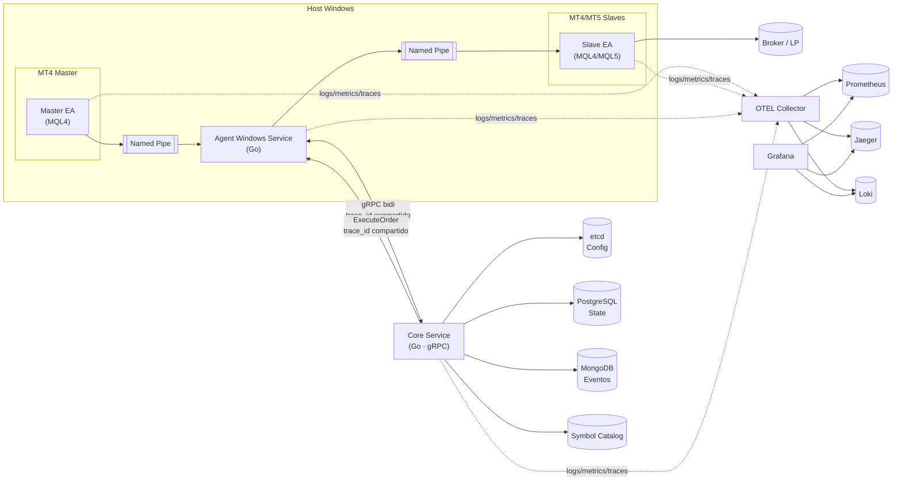

# RFC-001: Arquitectura del Sistema Echo

## 1. Resumen Ejecutivo

**Echo** es un MVP local para copiar **solo operaciones a mercado** desde **masters MT4** hacia **slaves MT4/MT5**, con **replicación de MagicNumber**, **modo hedged** siempre, **Money Management central en el core**, **SL/TP opcionales con tolerancia en points/pips**, y **ventanas de no-ejecución** manuales.

### Alcance V1 (según PRD)
- ✅ Solo órdenes **a mercado** (BUY/SELL, CLOSE)
- ✅ **Hedged mode** exclusivo (incluso en MT5)
- ✅ **MagicNumber idéntico** replicado en slaves
- ✅ **Money Management** centralizado en core (por cuenta × estrategia)
- ✅ **SL/TP opcionales** con offset configurable y respeto a StopLevel
- ✅ **Ventanas de no-ejecución** manuales (bloquean entradas, no cierres)
- ✅ **Tolerancias** (spread, slippage/desvío, delay máximo)
- ✅ **Observabilidad** end-to-end (OTEL → Prometheus, Loki, Jaeger)

### Fuera de Scope V1
- ❌ Órdenes pendientes (limit/stop)
- ❌ Reintentos inteligentes (V1 = "omit with comment")
- ❌ Event sourcing / replay determinista
- ❌ Seguridad avanzada (sin mTLS, sin KMS)

### Números Objetivo
- **Latencia**: < 1s extremo a extremo; < 100ms intra-host
- **Alcance**: 3-6 masters, ~15 slaves
- **Red**: Local (10 GbE)

---

## 2. Arquitectura de Componentes

### 2.1 Diagrama General



### 2.2 Componentes Principales

| Componente | Lenguaje | Responsabilidad |
|------------|----------|-----------------|
| **Core** | Go 1.25 | Orquestación, MM, políticas, reconciliación, dedupe |
| **Agent** | Go 1.25 | Bridge gRPC ↔ Named Pipes (IPC) |
| **Master EA** | MQL4/MQL5 | Emisión de TradeIntent al agent |
| **Slave EA** | MQL4/MQL5 | Ejecución de órdenes desde agent |
| **SDK** | Go 1.25 | Proto, telemetry (metricbundle/semconv), IPC helpers, domain |

### 2.3 Responsabilidades Detalladas (según PRD)

#### Core
- Orquestación de copiado
- **Money Management** central por cuenta × estrategia
- Políticas por **prop firm** y por **cuenta×símbolo**
- **Ventanas de no-ejecución**: evaluación y aplicación
- **Idempotencia/dedupe** por `trade_id` (UUIDv7)
- **Catálogo de símbolos**: `canonical_symbol` ⇄ `broker_symbol`
- **Estado réplica** por cuenta (posiciones, órdenes, equity, margen)
- **Sizing en slave**: con precio ejecución + SL + specs locales
- gRPC bidi server
- Persistencia: Postgres + Mongo
- Config live: etcd watches
- **TZ**: UTC interno; cortes por broker/tipo cuenta

#### Agent
- **Un solo agente por host** Windows (service)
- Conexión gRPC bidi al core
- IPC Named Pipes con EAs
- Ejecución: market in/out, modify SL/TP, close parcial
- Aplicación de filtros (spread/desvío locales)
- Reporte al core: coalesce ~250ms (equity, balance, margen, posiciones, ticks, specs)
- Telemetría propia
- **Regla V1**: ante desvío/spread → **omit with comment**

#### Master EA
- Publica **TradeIntent** con: magic_number, symbol, TF, ATR, SL/TP recomendados, strategy_id
- Emite eventos de cierre y modificaciones
- **NO** calcula MM
- **NO** evalúa ventanas

#### Slave EA
- Ejecuta comandos: market buy/sell, modify SL/TP, close (parcial/total)
- Reporta: ticks mínimos, estado cuenta, posiciones, órdenes
- Expone specs del símbolo (broker_symbol ⇄ canonical_symbol)
- Mantiene **MagicNumber igual** al master

---

## 3. Stack Tecnológico (según PRD)

### 3.1 Lenguajes
- **Core & Agent**: Go 1.25
- **Clientes**: MQL4, MQL5

### 3.2 Comunicación
- **Core ↔ Agent**: gRPC bidi-streaming (TLS opcional V1)
  - **trace_id COMPARTIDO** entre todas las aplicaciones para crear spans bajo las mismas trazas
  - **KeepAlive recomendado**: cliente `time>=60s`, `timeout=20s`; servidor `MinTime>=10s` (evitar "too many pings")
- **Agent ↔ EAs**: Named Pipes (Windows IPC) con JSON
- **Config API**: REST read-only vía grpc-gateway (futuro)
  - **GraphQL (NTH)**: sólo para capa de consulta read-only (estado/auditoría/dashboards). No usar en el hot path de ejecución

### 3.3 Persistencia
- **PostgreSQL 16**: Estado vivo, políticas, catálogos, calendario JSONB
- **MongoDB 7**: Eventos crudos (append-only)
- **etcd v3**: Config live con watches

### 3.4 Cache
- **Ristretto** in-process (core)
- **L2 opcional (NTH)**: Redis para consultas agregadas/dashboards. No usar en el hot path de ejecución

### 3.5 Observabilidad
 - **SDK**: `github.com/xKoRx/echo/sdk/telemetry` (con metricbundle y semconv)
- **Logs**: OpenTelemetry SDK Go → Loki (JSON estructurado)
- **Métricas**: OpenTelemetry SDK Go → Prometheus
- **Trazas**: OpenTelemetry SDK Go → Jaeger (**trace_id compartido**)
- **Dashboards**: Grafana
- **Collectors**: windows_exporter, Promtail Windows, OTEL Collector

### 3.6 Identidad/Idempotencia
- **i0 (implementado)**: `trade_id` temporal en UUID v4 (compatibilidad inmediata)
- **i1 (plan)**: migración a UUID v7 (RFC 9562, ordenable por tiempo)
- **Campos**: `trade_id`, `attempt`, `source_master_id`, `magic_number`, `strategy_id`

---

## 4. Contratos Proto V1 (Mínimos)

### 4.1 common.proto

```protobuf
enum OrderSide { BUY, SELL }
enum OrderStatus { PENDING, FILLED, REJECTED, CANCELLED }
enum ErrorCode { 
  INVALID_PRICE, INVALID_STOPS, OFF_QUOTES, REQUOTE, 
  BROKER_BUSY, TIMEOUT, ...
}
```

### 4.2 trade.proto

```protobuf
message TradeIntent {
  string trade_id = 1;          // UUIDv7
  int64 timestamp_ms = 2;
  string client_id = 3;         // Master EA ID
  string symbol = 4;
  OrderSide side = 5;
  double lot_size = 6;
  double price = 7;
  int64 magic_number = 8;
  int32 ticket = 9;             // MT4/MT5 ticket
  optional double stop_loss = 10;
  optional double take_profit = 11;
  int32 attempt = 12;
}

message ExecuteOrder {
  string command_id = 1;
  string trade_id = 2;
  string symbol = 4;
  OrderSide side = 5;
  double lot_size = 6;
  int64 magic_number = 7;
  optional double stop_loss = 8;
  optional double take_profit = 9;
}

message ExecutionResult {
  string command_id = 1;
  bool success = 2;
  int32 ticket = 3;
  ErrorCode error_code = 4;
  optional double executed_price = 6;
}

message TradeClose { ... }
message ModifyOrder { ... }
message AccountInfo { ... }
message PositionInfo { ... }
message SymbolInfo { ... }
```

### 4.3 agent.proto

```protobuf
service AgentService {
  rpc StreamBidi(stream AgentMessage) returns (stream CoreMessage);
  rpc Ping(PingRequest) returns (PingResponse);
}
```

---

## 5. Configuración en etcd

**Estructura propuesta** (sujeta a ajustes según necesidades MT4/MT5):

```
/echo/
  /policy/
    /{account_id}/
      /max_spread              → puntos
      /max_slippage            → puntos
      /max_delay_ms            → milisegundos
      /copy_sl_tp              → true/false
      /sl_offset               → puntos (ajuste)
      /tp_offset               → puntos (ajuste)
      /catastrophic_sl         → puntos (SL duro)
      /risk_fixed              → monto fijo (ej: 100, 200, 450)
  /windows/
    /{account_id}/{symbol}/
      /start_utc               → timestamp
      /end_utc                 → timestamp
      /pre_buffer_sec          → segundos
      /post_buffer_sec         → segundos
```

---

## 6. Money Management

### V1: Riesgo Fijo por Operación

**Configuración**: Por cuenta/estrategia
- Ejemplo: Estrategia 1 = $100, Estrategia 2 = $200, Estrategia 3 = $450

**Cálculo de Lot Size**:
```
1. Obtener precio de ejecución y SL del master
2. Calcular distancia en pips: distance_pips = |precio - SL| / point
3. Calcular lot_size: 
   lot_size = risk_fixed / (distance_pips × tick_value)
4. Ajustar a lot_step y clamp [min_lot, max_lot]
```

**Iteración 0 (POC)**: Lot size **hardcoded 0.10** para todo

**Futuro**: Agregar RR (Risk/Reward) a comentarios de la orden

---

## 7. Lógica Funcional V1 (según PRD)

### 7.1 Entrada
1. Validar **ventanas** y **políticas** de la cuenta
2. Verificar **spread máximo** y **desvío** respecto al precio del master
3. Si pasa filtros: enviar **market order** con tamaño calculado
4. **SL/TP**: opcionales con offset. Si StopLevel impide, colocar por **modificación** tras fill
5. Si no pasa filtros: **omit with comment**

### 7.2 Cierre
- Cerrar en slave cuando el master cierre, **independiente** de ventanas

### 7.3 Modificaciones
- Si SL/TP activos en slave y master los cambia: reflejar con **mismo offset**

### 7.4 Missed trade / Stop-out
- **No reabrir**
- Registrar evento y métricas
- Alertar

---

## 8. Observabilidad

### 8.1 Trazas Distribuidas con trace_id Compartido

**CRÍTICO**: El **trace_id se comparte** entre todas las aplicaciones (Master EA, Agent, Core, Slave EA) para crear spans bajo las mismas trazas distribuidas.

**Flujo**:
1. Master EA genera o recibe trace_id inicial
2. TradeIntent incluye trace_id
3. Agent propaga trace_id en gRPC al Core
4. Core propaga trace_id en ExecuteOrder al Agent  
5. Agent incluye trace_id en comando a Slave EA
6. Slave EA usa mismo trace_id para sus spans

**Resultado**: Traza completa Master → Slave bajo un único trace_id

### 8.2 Métricas Clave (según PRD)

- `latency_e2e_ms`: Latencia entrada/cierre
- `missed_trades_count` y ratio por cuenta/estrategia
- `avg_slippage_points`, `max_slippage_points`
- `spread_at_entry_points`
- `orders_rejected_count` por motivo (StopLevel, spread, desvío)
- `blocked_by_window_count`
- `policy_violations_count`
- `agent_tick_coalesce_ms`

### 8.3 Implementación

- **SDK**: `github.com/xKoRx/echo/sdk/telemetry`
- **metricbundle**: bundles especializados (HTTP, Document, etc.)
- **semconv**: convenciones semánticas para atributos
- **Atributos en contexto**: AppendCommonAttrs, AppendEventAttrs, AppendMetricAttrs

---

## 9. Roadmap de Iteraciones (según roadmap)

### Iteración 0 (POC 48h)
- Símbolo único (XAUUSD)
- 1 master MT4 → 2 slaves MT4 mismo host (broadcast desde Core)
- Solo market (BUY/SELL, CLOSE). Sin SL/TP
- **Sizing fijo hardcodeado: 0.10 lot**
- Contratos proto v1 (paquete `sdk/proto/v1`)
- Core mínimo: router + dedupe in-memory
- Agent: servicio Windows + Named Pipes + gRPC
- EAs: Master emite intent, Slave ejecuta
- IPC: JSON line-delimited (\n). DLL x86 sin `FlushFileBuffers` (no bloqueo). Lector no bloqueante con timeouts benignos
- Telemetría: OTLP/gRPC hacia `192.168.31.60` (traces 4317, metrics 14317)
- Keepalive gRPC ajustado (cliente y servidor) para evitar "too many pings"
- Cierre: Core envía `close_order` con `ticket=0` y `magic_number+symbol`; Slave resuelve ticket y cierra
- Resultado de cierre: Slave envía `close_result`; Agent lo mapea a `execution_result` y reenvía a Core
- Identidad: `trade_id` temporal UUID v4 en i0 (plan de migración a v7 en i1)

**Criterios**: p95 < 120ms, 0 duplicados, 10 ejecuciones OK

### Iteración 1 (72h)
- Persistencia: Postgres
- Idempotencia reforzada
- Health/Heartbeats + retry simple
- Métricas: latencia, copias ok, rechazos
- Identificación determinística de órdenes:
  - Mantener mapa `trade_id → {account_id → [tickets]}` por slave (persistente)
  - Al abrir (execution_result), registrar tickets del slave para ese `trade_id`
  - Al cerrar, `CloseOrder` debe incluir el `ticket` exacto del slave (no 0)
  - Estampar `trade_id` en `comment` al abrir como fallback de correlación
  - Soporte multi-ticket por `trade_id` (hedged/reaperturas) y cierre parcial por `ticket`
- Migración a UUID v7 (RFC 9562) end-to-end; compatibilidad de validación en SDK
- Auditoría de cierre: correlación exacta Master→Slave por `trade_id` y `ticket`
 - gRPC KeepAlive: reactivar pings de cliente con parámetros compatibles con el servidor (p.ej., `time>=60s`, `timeout=20s`, respetando `MinTime>=10s`), documentar política y tests de resiliencia
 - Named Pipes (modo prueba): opción de `FlushFileBuffers` configurable sólo para escenarios de benchmark/control, desactivado por defecto en producción para evitar bloqueos

### Iteración 2 (2-3 días)
- Registrar TP y SL
- Dedupe cleanup debe ser al close de la operación
- Corregir status de trades en postgres, cuando cierre la operación debe actualizar el estado.
- SL catastrófico opcional
- Filtros: max_spread, max_age_ms, max_slippage
- Logging de motivos de rechazo

- Routing selectivo Core→Agent por cuenta
  - Registrar ownership `account_id → agent_id` (el Agent anuncia sus cuentas al conectar)
  - Enrutar `ExecuteOrder`/`CloseOrder` sólo al Agent propietario (eliminar broadcast a todos)

- Normalización de `error_code` persistido
  - `NO_ERROR` en éxito; `ERR_*` en error; alinear mapeos en SDK y defaults de BD
  - Documentar contrato único para logs/BD/proto

- Alineación `execution_id` vs `command_id`
  - Definir convención única en esquema/contratos o documentar mapping estable

- Separación `MasterAccountID` vs `ClientID`
  - Incorporar `account_id` real en `TradeIntent` y `Trade` (queries por cuenta)
  - Mantener `SourceMasterID` para identificar al EA

- Cleanup para dedupe de `command_id`
  - Limpiar al close

- Identidad estable para Agents
  - `agent_id` persistente/configurable para ownership y diagnósticos

### Iteración 3 (2 días)
- Mapeo símbolos (canonical ⇄ broker)
- Specs de broker (min_lot, stop_level, etc.)
- Las EAs deben informar las especificaciones de símbolos del broker al cual están conectados (handshake con symbols[])
- Reporting de precios cada 250ms: Slaves reportan Bid/Ask actual cada 250ms (coalesced) para que Core calcule sizing óptimo y timing de entrada por cuenta
- Reconexión automática ea-agent y agent-core. Las EAs una vez que pierden la conexión no se vuelven a comunicar nunca más con el agente. Validar esto mismo con core-agent
- Limpiar los buffers de operaciones luego de que cierre una operación en EA, agent y core
- Core: validación de símbolos contra ETCD, traducción canonical→broker antes de enviar órdenes, persistencia en PostgreSQL
- Criterios de salida: 0 errores por símbolo desconocido; mapeo persistido y trazable

### Iteración 4 (1-2 días)
- **Sizing con riesgo fijo** (lo definido en sección 6)
- Guardas: min/max lot, lot_step
- Versionamiento del protocolo handshake: `protocol_version` para evolución de esquema (ej: 4.0)
- Feedback loop activo: Core→Agent→EA con `SymbolRegistrationResult` para notificar símbolos rechazados
- Validación de StopLevel en Core: Validar que SL/TP cumplen stop_level antes de enviar, ajustar o usar ModifyOrder post-fill si no cumple

### Iteración 5 (2 días)
- Multi-slave (1 master → N slaves)
- Paralelismo sin bloqueos

### Iteración 6 (2 días)
- SL/TP con offset
- StopLevel-aware (modify post-fill)
- Operaciones multi-timeframe

### Iteración 7 (2 días)
- CLI, empaquetado
- Panel Grafana con modo degradado visible (estado de configuración por cuenta)
- Manual
- Monitoreo avanzado: hash de configuración EA para detección de cambios, alertas operativas

---

## 10. Decisiones Arquitectónicas (ADRs)

Ver `/docs/adr/`:
- [ADR-001](adr/001-monorepo.md): Monorepo vs multi-repo
- [ADR-002](adr/002-grpc-transport.md): gRPC bidi-streaming
- [ADR-003](adr/003-named-pipes-ipc.md): Named Pipes para IPC
- [ADR-004](adr/004-postgres-state.md): Postgres para estado
- [ADR-005](adr/005-etcd-config.md): etcd para config live

---

## 11. Riesgos (según PRD)

| Riesgo | Mitigación |
|--------|------------|
| StopLevel impide SL/TP | ModifyOrder post-fill |
| Desfase horario | UTC interno, corte por broker |
| Divergencia PnL | Métricas slippage, tolerancias |
| Alta frecuencia modificaciones | Coalescing (~250ms) |
| Named Pipes inestables | Watchdog + reconexión |

---

## 12. Referencias

- [PRD V1](PRD-copiador-V1.md)
- [Contexto Técnico](trade-copier-context.md)
- [Roadmap](roadmap-copiear-v1.md)
- [MT4 MQL4 Reference](https://docs.mql4.com/)
- [MT5 MQL5 Reference](https://www.mql5.com/en/docs)

---

**Fin RFC-001 v1.0**
