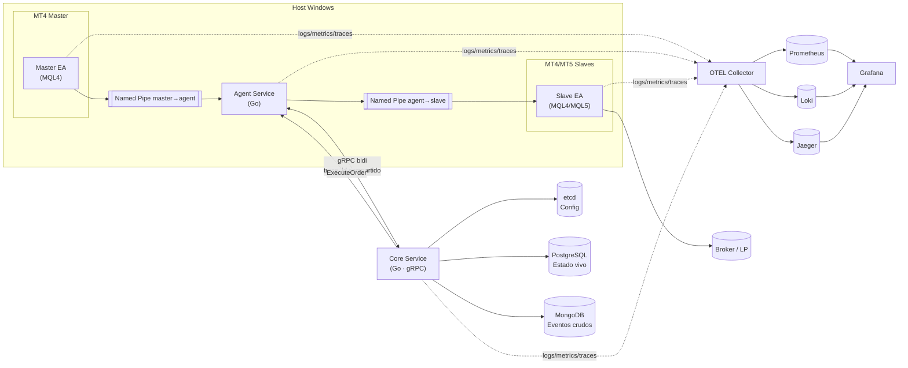

## 1. Resumen Ejecutivo

Echo es un copiador de operaciones local orientado a cuentas MT4/MT5 en modo hedged. El objetivo de V1 es replicar órdenes a mercado con latencia intra-host < 100 ms (p95), asegurar correlación determinística por `trade_id` (UUIDv7) y proveer observabilidad completa (logs JSON, métricas y trazas OTEL). Todo el diseño sigue principios de modularidad, SOLID y dependencia en la SDK común.

### 1.1 Alcance V1 (según PRD)

| Alcance | Estado |
|---------|--------|
| Órdenes a mercado BUY/SELL/CLOSE | ✅ |
| Hedged mode (incluye MT5) | ✅ |
| MagicNumber replicado en slaves | ✅ |
| Money Management centralizado (cuenta × estrategia) | ⏳ |
| SL/TP opcionales con offset y StopLevel awareness | ⏳ |
| Ventanas de no-ejecución manuales | ⏳ |
| Tolerancias (spread, slippage, delay) | ⏳ |
| Observabilidad end-to-end (OTEL → Prometheus, Loki, Jaeger) | ✅ |

### 1.2 Fuera de alcance V1

- Órdenes pendientes (limit/stop)
- Reintentos inteligentes (V1 = *omit with comment*)
- Event sourcing / replay determinista
- Seguridad avanzada (mTLS/KMS)

### 1.3 Objetivos cuantitativos

- Latencia E2E < 1 s; intra-host < 100 ms p95
- 3–6 masters, ~15 slaves por host Windows
- Red local 10 GbE

### 1.4 Estados de funcionalidades

Leyenda: ✅ Done · 🚧 WIP · ⏳ Todo · 🕸️ Deprecated · ❌ Cancelled. La tabla completa de funcionalidades se mantiene en la sección 6.

## 2. Principios Arquitectónicos

- Independencia de módulos: ningún binario importa paquetes de otros módulos del monorepo.
- DIP/SOLID: programación contra interfaces en SDK y Core, composición sobre herencia.
- Configuración centralizada vía `github.com/xKoRx/sdk/pkg/shared/etcd`; carga única y caché in-process.
- Observabilidad obligatoria con `sdk/telemetry` (logs JSON, métricas OTEL, trazas). Contexto propagado end-to-end.
- Idempotencia estricta con UUIDv7 y correlación por ticket en cada slave.
- Money Management y políticas viven en el Core; EAs no toman decisiones de negocio.
- Errores jamás se silencian: se registran y propagan explícitamente.
- Entities y contratos de dominio residen en la SDK compartida.

## 3. Arquitectura de Componentes

### 3.1 Diagrama global



### 3.2 Componentes principales

| Componente | Lenguaje | Responsabilidad | Estado |
|------------|----------|-----------------|--------|
| Core | Go 1.25 | Orquestación, políticas, dedupe, persistencia, métricas | 🚧 (i4) |
| Agent | Go 1.25 | Bridge gRPC ↔ Named Pipes, ownership de cuentas, snapshots, heartbeats | ✅ |
| Master EA | MQL4/MQL5 | Emite `TradeIntent` y eventos de cierre | ✅ |
| Slave EA | MQL4/MQL5 | Ejecuta comandos, reporta `ExecutionResult`, expone specs | ✅ |
| SDK | Go 1.25 | Proto, dominio, validaciones, telemetry, IPC helpers | ✅ |
| Infra soporte | etdc, PostgreSQL, MongoDB*, OTEL stack | 🚧 |

## 4. Componentes Detallados

### 4.1 Master EA
- Emite `TradeIntent`, `TradeClose`, `TradeModify` con trace id compartido.
- No realiza Money Management ni filtros de spread.
- Logs estructurados vía `JAson.mqh` (JSON con campos obligatorios).

### 4.2 Agent
- Mantiene un pipe por EA (`handshake`, `trade_intent`, `execution_result`, `symbol_spec_report`, `quote_snapshot`).
- Gestiona ownership `account_id → agent_id` y envía `AccountConnected/Disconnected`.
- Coalesce snapshots (equity, posiciones, quotes) cada 250 ms.
- Implementa heartbeats gRPC, reconexión y backpressure con timeouts.
- Métricas bajo `echo.agent.*`.

### 4.3 Core
- Router secuencial (roadmap hacia worker pool por `trade_id`).
- Servicios: `SymbolResolver`, `SymbolSpecService`, `RiskPolicyService` (TTL corto + invalidación `LISTEN/NOTIFY`, rechazo inmediato sin política), `DedupService`, `AccountRegistry`, `CorrelationService`.
- Persistencia en PostgreSQL: `trades`, `executions`, `closes`, `dedupe`, `account_symbol_map`, `account_symbol_spec`, `account_strategy_risk_policy` (esquema tipado `FIXED_LOT`).
- Orquestación: cálculo de lotes (próximas iteraciones), aplicación de políticas, envío de comandos selectivos.
- Telemetría con bundles `EchoMetrics`, spans `core.*` y contadores `echo.specs.*`, `echo.risk.*`.

### 4.4 Slave EA
- Ejecuta `OrderSend`, `OrderClose`, `OrderModify` (offsets/StopLevel en roadmap).
- Envía `ExecutionResult` con timestamps `t0…t7`, logs estructurados y `terminal_boot_id` + `server_time_ms` para evitar staleness.
- Publica `symbol_spec_report` y `quote_snapshot` (250 ms) tras handshake y reconexión.

### 4.5 SDK Echo
- Proto `agent.proto`, `trade.proto`, `common.proto` (mensajes compartidos).
- Validadores y transformadores (`TradeIntentToExecuteOrder`, `ValidateSymbolSpecReport`, etc.).
- Telemetry unificada (`sdk/telemetry`, `metricbundle`, `semconv`).
- Utilidades: UUID v7, timestamps, JSON, Named Pipes.

## 5. Arquitectura Funcional

### 5.1 Flujo de datos

1. Master EA detecta fill (`t0`) y envía `TradeIntent`.
2. Agent añade `t1`, transforma a proto y envía al Core (`t2`).
3. Core deduplica, valida políticas, registra en BD, crea `ExecuteOrder`, añade `t3`.
4. Agent recibe orden (`t4`), enruta al owner, envía por Named Pipe.
5. Slave EA ejecuta (`t5–t7`), responde `ExecutionResult` → Agent → Core.
6. Core persiste ejecución, actualiza correlación (trade_id ↔ tickets), calcula métricas y spans.
7. Al cierre, Master envía `TradeClose`; Core busca tickets exactos y emite `CloseOrder`.

### 5.2 Lógica V1 (según PRD)

**Entrada**
1. Validar ventanas y políticas por cuenta.
2. Verificar spread/desvío vs parámetros.
3. Si pasa filtros, enviar orden de mercado con lot calculado.
4. SL/TP opcionales con offset; si StopLevel impide, modificar post-fill.
5. Si falla alguna política, `omit with comment` (hasta que se habilite reintento).

**Cierre**
- Cerrar en slave cuando el master cierre, sin bloquear por ventanas.

**Modificaciones**
- Reproducir cambios de SL/TP del master con offset; manejar StopLevel en iteraciones 8a/8b.

**Missed trades / stop-out**
- No reabrir; registrar eventos y métricas `missed_trades_count`.

## 6. Funcionalidades Clave V1

| Funcionalidad | Descripción | Iteración | Estado |
|---------------|-------------|-----------|--------|
| Replicación market hedged | Copiado 1 master → N slaves MT4/MT5, modo hedged, MagicNumber replicado. | i0 | ✅ |
| Observabilidad base | Logs JSON estructurados, métricas y trazas OTEL desde todos los componentes. | i0 | ✅ |
| UUIDv7 & dedupe persistente | Correlación determinística `trade_id`, `command_id`, persistencia en PostgreSQL. | i1 | ✅ |
| Keepalive & heartbeats | gRPC bidi con keepalive, heartbeats Agent-Core, reconexión automatizada. | i1 | ✅ |
| Routing selectivo | Ownership `account_id → agent_id`, envío dirigido de comandos. | i2 | ✅ |
| Control de backpressure en broadcast | Timeouts de envío a canales, latencia estabilizada (<500 ms). | i2b | ✅ |
| Catálogo canónico de símbolos | `canonical_symbol ⇄ broker_symbol`, validación pre-orden, snapshots 250 ms. | i3 | ✅ |
| Guardián de especificaciones | Caché + persistencia `min_lot`, `lot_step`, `stop_level`; clamps previos a `ExecuteOrder`. | i4 | ✅ |
| Políticas `FIXED_LOT` | Registro en Postgres + caché `RiskPolicyService`; rechazo sin política. | i4 | ✅ |
| Versionado de handshake & feedback | `protocol_version`, `SymbolRegistrationResult`. | i5 | ⏳ |
| Sizing con riesgo fijo (Modo A) | Distancia SL × tick value; clamps min/max lot. | i6 | ⏳ |
| Filtros de spread y desvío | Evaluación de tolerancias por cuenta×símbolo. | i7 | ⏳ |
| SL/TP con offset | Aplicar offsets configurables en apertura. | i8a | ⏳ |
| StopLevel-aware + modify post-fill | Validar StopLevel y ajustar tras fill. | i8b | ⏳ |
| Ventanas de no ejecución | Calendarios por cuenta/símbolo. | i9 | ⏳ |
| SL catastrófico | Protección independiente del master. | i10 | ⏳ |
| Espera de mejora (time-boxed) | Buscar mejor precio en ventana acotada. | i11 | ⏳ |
| Normalización de `error_code` | Diccionario único logs/BD/métricas. | i12 | ⏳ |
| Concurrencia por `trade_id` | Worker pool ordenado sin bloqueos. | i13a | ⏳ |
| Backpressure y límites de cola | Buffers configurables + métricas. | i13b | ⏳ |
| Telemetría avanzada | Dashboards de funneles, slippage, latencias. | i14 | ⏳ |
| Paquetización & operación | CLI/scripts, health checks, runbooks. | i15 | ⏳ |
| Políticas operativas (DD, apalancamiento) | Límites globales por cuenta. | i16 | ⏳ |
| Eventos crudos en MongoDB | Event store append-only. | TBD | ⏳ |
| SymbolMappings en Master | Master EA consume catálogo canónico y publica símbolos ya normalizados. | TBD | ⏳ |

## 7. Stack Tecnológico

### 7.1 Lenguajes
- Core & Agent: Go 1.25
- EAs: MQL4/MQL5

### 7.2 Comunicación
- Core ↔ Agent: gRPC bidi streaming (TLS opcional V1) con trace id compartido y keepalive (`time>=60s`, `timeout=20s`, `MinTime>=10s`).
- Agent ↔ EAs: Named Pipes Windows (JSON line-delimited). DLL x86/x64 según terminal.
- Config API (futuro): REST read-only vía grpc-gateway (GraphQL NTH solo lectura).

### 7.3 Persistencia
- PostgreSQL 16: estado vivo, políticas, catálogos, calendarios.
- MongoDB 7: eventos crudos (iteración futura).
- ETCD v3: configuración live con watches, namespaces `/echo/core/...`.

### 7.4 Cache
- Ristretto in-process (Core) para resolvers/specs/políticas.
- L2 (NTH): Redis solo para dashboards agregados.

### 7.5 Observabilidad
- Logs, métricas y trazas mediante `sdk/telemetry` → OTEL Collector → Prometheus/Loki/Jaeger.
- Collectors complementarios: `windows_exporter`, `Promtail`, `OTEL Collector`.

### 7.6 Identidad / Idempotencia
- i0: UUIDv4 (compatibilidad). i1+: migración completa a UUIDv7.
- Campos clave: `trade_id`, `command_id`, `magic_number`, `strategy_id`, `attempt`.

## 8. Contratos Proto

### 8.1 `common.proto`
```protobuf
enum OrderSide { BUY = 0; SELL = 1; }
enum OrderStatus { PENDING = 0; FILLED = 1; REJECTED = 2; CANCELLED = 3; }
enum ErrorCode {
  ERROR_CODE_UNSPECIFIED = 0;
  ERROR_CODE_INVALID_PRICE = 1;
  ERROR_CODE_INVALID_STOPS = 2;
  ERROR_CODE_OFF_QUOTES = 3;
  ERROR_CODE_REQUOTE = 4;
  ERROR_CODE_BROKER_BUSY = 5;
  ERROR_CODE_TIMEOUT = 6;
  ERROR_CODE_SPEC_MISSING = 1001;
  ERROR_CODE_RISK_POLICY_MISSING = 1002;
}
```

### 8.2 `trade.proto`
```protobuf
message TradeIntent {
  string trade_id = 1;
  int64 timestamp_ms = 2;
  string client_id = 3;
  string symbol = 4;
  OrderSide side = 5;
  double lot_size = 6;
  double price = 7;
  int64 magic_number = 8;
  int32 ticket = 9;
  optional double stop_loss = 10;
  optional double take_profit = 11;
  int32 attempt = 12;
  map<string, int64> timestamps = 20; // t0..t7
}

message ExecuteOrder {
  string command_id = 1;
  string trade_id = 2;
  string symbol = 4;
  OrderSide side = 5;
  double lot_size = 6;
  int64 magic_number = 7;
  optional double stop_loss = 8;
  optional double take_profit = 9;
}

message ExecutionResult {
  string command_id = 1;
  bool success = 2;
  int32 ticket = 3;
  ErrorCode error_code = 4;
  optional double executed_price = 6;
  map<string, int64> timestamps = 20; // t0..t7
}
```

### 8.3 `agent.proto`
```protobuf
service AgentService {
  rpc StreamBidi(stream AgentMessage) returns (stream CoreMessage);
  rpc Ping(PingRequest) returns (PingResponse);
}
```

## 9. Configuración ETCD

Estructura típica (`/echo/...`):
```
/echo/
  /core/
    /default_lot_size            (LEGACY - se elimina en i5)
    /specs/
      default_lot
      missing_policy             → "reject"
      max_age_ms                 → p.ej. 10000
      alert_threshold_ms         → p.ej. 8000
    /risk/
      missing_policy             → "reject"
      cache_ttl_ms               → default 5000
  /policy/{account_id}/
    max_spread
    max_slippage
    max_delay_ms
    copy_sl_tp
    sl_offset
    tp_offset
    catastrophic_sl
    risk_fixed                   → monto fijo (i6+)
  /windows/{account_id}/{symbol}/
    start_utc
    end_utc
    pre_buffer_sec
    post_buffer_sec
```

## 10. Money Management

- Iteración 0: lot fijo hardcoded (0.10).
- Iteración 4: políticas `FixedLot` registradas en Postgres; ausencia = rechazo.
- Iteración 6: cálculo riesgo fijo (`lot = riesgo / (distancia_pips × tick_value)`), clamps `[min_lot, max_lot]`, ajuste a `lot_step`.
- Futuro: cálculo RR (Risk/Reward) y estrategias adicionales (`FixedRisk`, `Kelly`, etc.).

## 11. Observabilidad y Calidad

- Métricas mínimas activas: latencias por hop, `orders_success_total`, `orders_rejected_total`, `agent_heartbeat`.
- Métricas nuevas por iteración: `echo.specs.*`, `echo.risk.*`, `echo.backpressure.*`.
- Logs JSON homogéneos (sin `fmt.Println`). Atributos comunes inicializados en `core/cmd/echo-core/main.go` (`bootstrapTelemetry`).
- Trazas jerárquicas: `core.handle_trade_intent`, `core.volume_guard`, `core.risk_policy.get`, `agent.handle_symbol_spec_report`, etc.
- KPIs: p95 E2E < 1000 ms, ratio copia exitosa > 99%, monitoreo de slippage y spread.

## 12. Estado del Roadmap (2025-11-05)

- ✅ i0 — POC market-only con lot fijo y telemetría base.
- ✅ i1 — Persistencia, dedupe, keepalive/heartbeats.
- ✅ i2 — Routing selectivo.
- ✅ i3 — Catálogo canónico + specs base en repositorios, reporting 250 ms.
- 🚧 i4 — Guardián de especificaciones y políticas `FIXED_LOT` centralizadas.
- ⏳ Iteraciones siguientes según `docs/01-arquitectura-y-roadmap.md`.

## 13. Riesgos y mitigaciones

| Riesgo | Mitigación |
|--------|------------|
| StopLevel impide SL/TP | ModifyOrder post-fill (i8b) |
| Desfase horario | UTC interno, corte por broker |
| Divergencia de PnL | Métricas de slippage y tolerancias |
| Alta frecuencia en modificaciones | Coalescing (~250 ms) |
| Named Pipes inestables | Watchdog + reconexión automática |
| Falta de políticas de riesgo | Rechazo inmediato + alertas `risk_policy_missing` |

## 14. Referencias

- `docs/01-arquitectura-y-roadmap.md`
- `docs/rfcs/RFC-004-iteracion-4-especificaciones-broker.md`
- `docs/rfcs/RFC-004c-iteracion-3-parte-final-slave-registro.md`
- `docs/rfcs/RFC-003-iteration-1-implementation.md`
- `docs/roadmap-copiear-v1.md`
- `docs/reports/i3-implementation-gap.md`
- `docs/adr/001-monorepo.md`
- `docs/adr/002-grpc-transport.md`
- `docs/adr/003-named-pipes-ipc.md`
- `docs/adr/004-postgres-state.md`
- `docs/adr/005-etcd-config.md`
