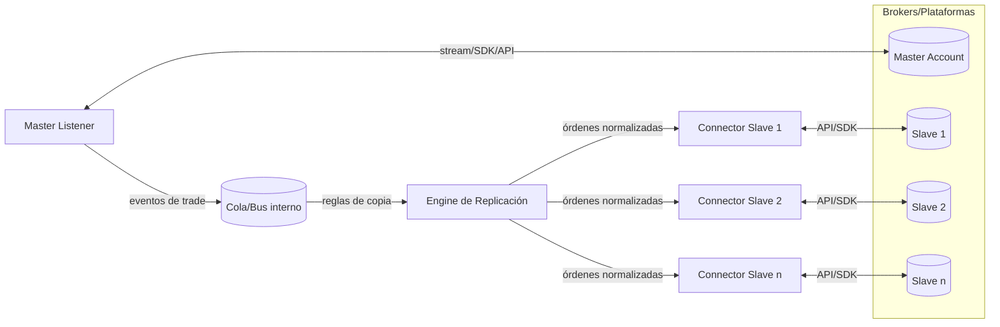

# Copiador de Operaciones en Trading Algorítmico — Documento de Contexto Técnico

> Propósito: entregar a una IA asistente el contexto completo para diseñar, implementar y validar un copiador de operaciones **local** y escalable, empezando por un **MVP basado en órdenes a mercado con SL/TP y tolerancia en pips**.

---

## 1) ¿Qué es un copiador de operaciones y para qué se usa?

Un **copiador de operaciones** replica en una o varias cuentas seguidoras (**slaves**) las operaciones ejecutadas en una cuenta **maestra** (**master**). Su objetivo: **sincronía operacional** y **reproducción de la estrategia** en múltiples cuentas con el menor desvío posible.

**Usos típicos**
- Gestión multi‑cuenta personal o de clientes.
- Distribución de estrategias algorítmicas a carteras con tamaños distintos.
- Estandarización de la ejecución en entornos heterogéneos (brokers, plataformas, latencias).
- Pruebas A/B entre brokers o condiciones de ejecución.

**Modos de despliegue**
- **Local**: procesos/agents en la misma máquina/VPS que las plataformas (latencia mínima, control total).
- **SaaS**: servicio en la nube (multi‑plataforma, HA, menor fricción). Este documento se centra en **local** para el MVP.

---

## 2) Arquitectura de alto nivel

**Componentes**
- **Master Listener**: detecta *fills*, modificaciones y cierres en tiempo real.
- **Engine de Replicación**: aplica reglas (scaling, tolerancias, filtros, offsets) y decide la acción en cada slave.
- **Connectors**: adaptadores por plataforma/broker (MT4/5, cTrader, FIX/REST, etc.).
- **Observabilidad**: métricas (latencia, slippage), logs estructurados, trazas por orden.
- **Persistencia mínima**: estado de posiciones por cuenta y auditoría de eventos.

---

## 3) Casos de uso clave, problemáticas y estrategias de solución

> Enfocado al MVP: **entrada por órdenes a mercado**. SL/TP **copiados u opcionales**, con **tolerancia en pips** y **offsets** configurables.

### 3.1 Spread distinto y slippage en entrada/salida
- **Problema**: brokers con precios/feeds y spreads distintos ⇒ slippage inevitable al copiar “después” del master.
- **Impacto**: peor precio de entrada/salida; erosiona estrategias de bajo TP.
- **Estrategias**  
  - **Tolerancia en pips**: ejecutar si |precio_slave − precio_master| ≤ X pips; si no, **abortar** o **esperar mejora**.
  - **Espera de mejora**: durante Y ms o hasta −Z pips de mejora; si no ocurre, descartar.
  - **Filtro de spread**: no copiar si spread actual > umbral.
  - **Paralelismo**: enviar a todos los slaves en paralelo para evitar “últimos en la fila”.

### 3.2 SL/TP desincronizados entre brokers
- **Problema**: el slave puede tocar SL/TP local que el master no toca por diferencias de cotización.
- **Impacto**: slave sale antes o distinto ⇒ divergencias de P/L.
- **Estrategias**  
  - **Modo A (copiar SL/TP)**: con **offset** configurable (+/− pips) para evitar triggers prematuros.
  - **Modo B (sin SL/TP locales)**: cerrar en slave **solo** cuando cierra el master. Añadir **SL de emergencia** amplio opcional.
  - **Actualización de niveles**: propagar cambios de SL/TP del master a los slaves con baja latencia.

### 3.3 Missed trade (el slave no entra)
- **Problema**: al llegar la señal, el precio del slave ya se movió fuera de tolerancia o hubo error/transiente.
- **Impacto**: slave queda fuera de la operación.
- **Estrategias**  
  - **Reintentos rápidos** con *backoff* corto.  
  - **Política del MVP**: no re‑ingresar automáticamente; registrar y alertar.  
  - **Futuro**: *auto‑sync* opt‑in para abrir “tarde” si la posición sigue abierta y dentro de límites de riesgo.

### 3.4 El slave cierra antes (stop‑out, cierre manual, error)
- **Problema**: posición cerrada localmente mientras el master sigue abierto.
- **Impacto**: desincronización hasta el cierre del master.
- **Estrategias**  
  - **MVP**: no reabrir. Log + alerta.  
  - **Futuro**: re‑ingreso bajo reglas (tiempo desde entrada, distancia al entry, límite de riesgo).

### 3.5 Modificación de SL/TP del master
- **Problema**: el master mueve SL/TP; slaves deben reflejarlo.
- **Estrategias**  
  - Si **copias SL/TP**: sincronizar niveles con *idempotencia* y verificación de StopLevel.  
  - Si **no copias**: ignorar niveles y **cerrar por señal** del master.

### 3.6 Desconexiones, latencia y orden fallida
- **Problema**: timeouts, requotes, rechazos, jitter de red.
- **Estrategias**  
  - **Reintentos N** con códigos de error manejados.  
  - **Tiempo máximo de retraso**: si la copia supera T ms, descartar.  
  - **Heartbeats** y detección de caídas; *fail‑fast* con alerta.

### 3.7 Mapeo de símbolos y reglas de broker
- **Problema**: símbolos con sufijos/prefijos diferentes, mínimos de stop, FIFO/netting, tamaños de contrato.
- **Estrategias**  
  - **Tabla de mapeo** por cuenta: `EURUSD`→`EURUSD.m`, `US100.cash`→`NAS100`.  
  - **Validaciones de StopLevel/tickSize** previo a enviar.  
  - **Modos de cierre** compatibles con FIFO/netting.

### 3.8 Tamaño de posición y escalado
- **Problema**: balances y contratos distintos.
- **Estrategias**  
  - **Multiplicador** (lot o nocional), **lote fijo**, **riesgo fijo** (% equity usando SL).  
  - **Límites**: min/max lote por trade, por símbolo y diario.

### 3.9 Cierres parciales y múltiples posiciones
- **Problema**: el master cierra parcial; en netting solo hay posición agregada.
- **Estrategias**  
  - **Proporcional** por volumen disponible; redondeo a granularidad mínima.  
  - En **netting**: ajustar cantidad de la posición (reduce/increase).

### 3.10 Filtros y seguridad
- **Problema**: condiciones no deseadas (alta volatilidad, horarios, noticias).
- **Estrategias**  
  - Filtros por **símbolo**, horario, spread, tamaño, *blacklist*.  
  - **Equity/Drawdown guard** por cuenta slave.  
  - **SL de emergencia** si no hay SL del master.

---

## 4) Especificación del MVP (Local, market‑only)

**Objetivo**: copia local **rápida y robusta** para uso personal y compartible en entorno local.

**Alcance funcional**
- **Entradas**: solo **órdenes a mercado** (buy/sell).  
- **Salidas**: cierre por **señal del master**; opcional SL/TP local.
- **SL/TP**:  
  - Modo **copiar** con **offset configurable** en pips.  
  - Modo **sin SL/TP** + **SL de emergencia** opcional.
- **Tolerancias**:  
  - **Slippage máx** (pips) en entrada/salida.  
  - **Espera de mejora** (pips/ms) opcional.  
  - **Delay máx** para ejecutar; si se excede, descartar.
- **Reintentos**: N intentos con backoff corto ante `requote`, `offquotes`, `busy`, `timeout`.
- **Mapeo**: archivo por cuenta con símbolos y normalización de tamaños.
- **Escalado**: multiplicador, lote fijo o riesgo fijo por cuenta.
- **Observabilidad**: logs JSON por evento, métricas de latencia, tasa de éxitos, slippage p50/p95/p99.
- **Config**: YAML/TOML; hot‑reload opcional.

**No cubierto en MVP**
- Copia de **órdenes pendientes**.  
- **Auto‑sync** para re‑ingreso tardío.  
- Dashboard web.  
- Multi‑proveedor SaaS.

---

## 5) Reglas de decisión del Engine (pseudológica)

1. **OnFill(master.open)**  
   - Si `spread_slave > max_spread`: **skip**.  
   - Δp = `price_slave_now − price_master_fill` (con signo).  
   - Si `|Δp| ≤ max_slip`: **market**.  
   - Si `wait_improvement` activo y `Δp > 0` (compra) o `Δp < 0` (venta): esperar hasta `Δp ≤ target` o timeout ⇒ si no, **skip**.
2. **OnModify(master.SL/TP)**  
   - Modo copiar: validar StopLevel y **update**; aplicar `offset` si procede.  
   - Modo no copiar: **ignore**.
3. **OnClose(master)**  
   - **market close** en slaves activos. Reintentos si falla.
4. **OnError(slave.order)**  
   - Reintentar hasta N. Si excede T total ⇒ **abort + alert**.

---

## 6) Métricas y SLO técnicos

- **Latencia copiado** p50/p95/p99 (ms). **SLO**: p95 < 100 ms local.  
- **Slippage** p50/p95 (pips) por símbolo.  
- **Tasa de copia exitosa** (% eventos aplicados/emitidos).  
- **Divergencias**: % trades con diferencias > umbral de P/L.  
- **Errores por código** y reintentos.  
- **Disponibilidad** del listener y conectores.

---

## 7) Pruebas recomendadas (matriz)

- **Unitarias**: cálculo de tamaño, offsets, tolerancias, mapeos, FIFO/netting.  
- **Integración**: entrada/cierre simultáneo en N slaves, reintentos, desconexión y reconexión.  
- **Estrés**: ráfagas de señales, N cuentas, símbolos múltiples.  
- **Canaries**: *dry‑run* con logs, sin ejecutar órdenes reales.  
- **Reproducibilidad**: semillas y *fixtures* de ticks para comparar P/L master vs slaves.

---

## 8) Extensiones futuras

- **Modo órdenes pendientes** (replicar *limits/stops* del master).  
- **Auto‑sync** configurable para re‑ingreso tardío.  
- **Dashboard web** y control remoto.  
- **Compatibilidad multi‑plataforma** (cTrader, FIX/REST, TV alerts).  
- **HA**: proceso redundante/“sentinel”, colas persistentes.  
- **Políticas avanzadas**: trailing local, partial close rules, *reverse copy*.

---

## 9) Glosario breve

- **Slippage**: diferencia entre precio esperado vs ejecutado.  
- **Offset (SL/TP)**: ajuste en pips aplicado a los niveles copiados.  
- **StopLevel**: distancia mínima de SL/TP que exige el broker.  
- **FIFO/Netting**: reglas de cierre/posición única por símbolo.  
- **p50/p95/p99**: percentiles de métricas.

---

## 10) Resumen ejecutivo para el MVP

- **Market‑only** para entradas y cierres.  
- **Tolerancia en pips** + **filtro de spread** + **delay máximo**.  
- **SL/TP**: copiar con **offset** o no copiar y cerrar por señal; **SL de emergencia** opcional.  
- **Mapeo/escala** por cuenta; **reintentos** y **observabilidad** de primera.  
- Entregable **local, robusto y modular** listo para escalar luego.
